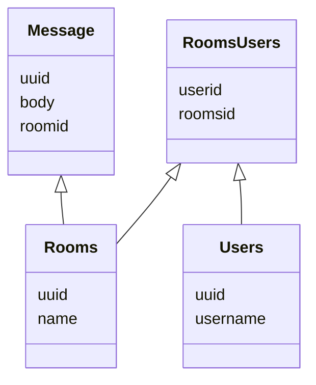

## Todo:
- [ ] Create routes for sending messages
    - [ ] Handling the saving of the new items inside it
    - [ ] We need to learn how to handle json import
- [x] Setup database (POSTGRES) -> docker?
- [X] Research what kind of cargos can I use to connect to a DB (Diesel)
- [X] Do initial bootstrap for connection with DB.
- [ ] Setup socket connections
- [ ] During socket connection save messages
  - [ ] Users we need to save user names
    - [ ] Combine usernames to messages

use migration::{Migrator, MigratorTrait};

let connection = sea_orm::Database::connect(&database_url).await?;
Migrator::up(&connection, None).await?;

The idea of how we will save stuff is that there is a room where we connect
the people in it. This means that 2 users in a means it is a personal chat and multiple people.
Inside the message we save to which room id it is stored. (this might change over time)

