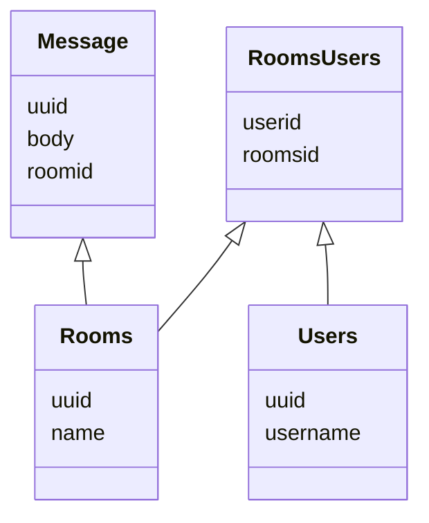

## Todo:
- [X] Create routes for sending messages
    - [X] Handling the saving of the new items inside it
    - [X] We need to learn how to handle json import
- [x] Setup database (POSTGRES) -> docker?
- [X] Research what kind of cargos can I use to connect to a DB (Diesel)
- [X] Do initial bootstrap for connection with DB.
- [ ] Setup socket connections
- [ ] During socket connection save messages
  - [ ] Users we need to save usernames
    - [ ] Combine usernames to messages
- [ ] Need to better routing inside actix web
  - [X] Pass db connection to endpoints, so we do not have to initialize it everytime
  - [ ] We need to check what the proper way is of handling multiple routes because currently I do not have the feeling this is correct
- Error Handling
  - [X] Learn on how to handle errors from find queries
  - [X] How do I return a error from the API when something is not correct 
  - [X] How do we catch errors when unwrapping uuid parses
- Architect code
  - [X] Implement one 'impl'
  - [X] Implement impl with struct
  - [ ] trait vs impl
- Rooms
  - [ ] Save more info in rooms
  - [ ] Create for rooms to collect rooms with bound users
  - [ ] Think about how we are going to setup private conversation inside database
- Users
  - [ ] Create user endpoint to collect his rooms information
- Messages
  - [ ] Collect messages for room and see what messages are from whom and bound to room
  - [ ] Save connection to room also with message inside transaction
  - [ ] rewrite messages.rs
- Api
  - [ ] Write match impl for standard authentication

use migration::{Migrator, MigratorTrait};

let connection = sea_orm::Database::connect(&database_url).await?;
Migrator::up(&connection, None).await?;

The idea of how we will save stuff is that there is a room where we connect
the people in it. This means that 2 users in a means it is a personal chat and multiple people.
Inside the message we save to which room id it is stored. (this might change over time)

A message is many to one to a user
A message is a many to many with a room

User to Rooms can many to many

#todo update this diagram
